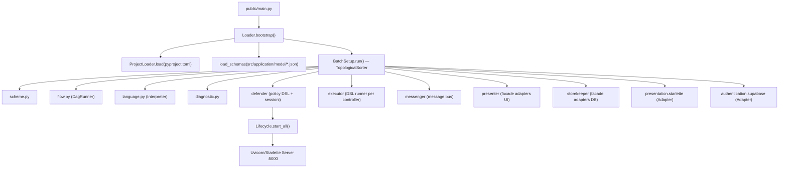
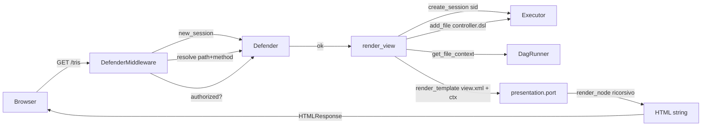
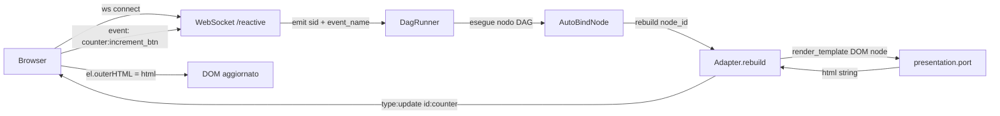

# 🔍 OmniPort Framework — Report MVP

> **Data:** 14 Aprile 2026
> **Scope:** Analisi completa del repository per identificare cosa manca, cosa va corretto e cosa va migliorato per raggiungere un MVP funzionante.

---

## 📐 Panoramica Architetturale

Il framework segue un'**Architettura Esagonale** (Ports & Adapters), con dependency injection automatica, un DSL custom (Lark-based), e un DAG engine reattivo (`flow.py`).

---

### 🗂️ Struttura Directory

```
framework/
├── public/
│   ├── main.py                  ← Entry point
│   ├── js/                      ← Static JS (dsl.js, grid.js)
│   └── index.php
│
├── pyproject.toml               ← Config: adapters, policy, host/port
├── requirements.txt
│
└── src/
    ├── framework/               ← CORE del framework
    │   ├── manager/             ← Orchestratori (lifecycle)
    │   │   ├── loader.py        ← DI container + bootstrap
    │   │   ├── defender.py      ← Auth, sessioni, policy, routing
    │   │   ├── executor.py      ← DSL interpreter runner
    │   │   ├── messenger.py     ← Message bus
    │   │   ├── presenter.py     ← Facade presentation adapters
    │   │   ├── storekeeper.py   ← Facade persistence adapters
    │   │   ├── tester.py        ← Test runner DSL
    │   │   ├── actuator.py      ← (solo commento)
    │   │   ├── sensor.py        ← (solo commento)
    │   │   └── inferencer.py    ← (vuoto)
    │   │
    │   ├── port/                ← Interfacce (ABC)
    │   │   ├── presentation.py  ← Port UI + XML renderer
    │   │   ├── persistence.py   ← Port CRUD
    │   │   ├── authentication.py← Port auth (auto-decora metodi)
    │   │   ├── authorization.py ← Port authz (stub)
    │   │   ├── message.py       ← Port messaggi
    │   │   └── actuator.py      ← Port attuatori
    │   │
    │   └── service/             ← Servizi puri (no I/O)
    │       ├── flow.py          ← DAG engine reattivo (DagRunner)
    │       ├── language.py      ← DSL parser + Interpreter (Lark)
    │       ├── scheme.py        ← Validazione/trasformazione dati (Cerberus)
    │       ├── diagnostic.py    ← Logger strutturato
    │       ├── factory.py       ← Factory helper
    │       ├── telemetry.py     ← Telemetria (context manager)
    │       └── logging.py       ← (vuoto)
    │
    ├── infrastructure/          ← Adapters concreti
    │   ├── presentation/
    │   │   └── starlette.py     ← HTTP server + WebSocket + HTML renderer
    │   ├── authentication/
    │   │   └── supabase.py      ← Auth via Supabase
    │   ├── persistence/
    │   │   ├── supabase.py      ← DB Supabase
    │   │   ├── redis.py         ← Cache Redis
    │   │   ├── api.py           ← REST API esterna
    │   │   └── web.py           ← Web scraping
    │   ├── message/
    │   │   ├── console.py       ← Log su console
    │   │   └── redis.py         ← Pub/Sub Redis
    │   ├── actuation/           ← (vuoti)
    │   ├── encryption/          ← (vuoti: rsa.py, aes.py)
    │   ├── inference/           ← (vuoti: machine.py, deep.py)
    │   └── sensation/           ← (vuoto: webcam.py)
    │
    └── application/             ← Codice applicativo
        ├── model/               ← JSON Schema (cerberus)
        │   ├── user.json
        │   ├── session.json
        │   ├── product.json
        │   └── ...
        ├── policy/              ← Regole DSL
        │   ├── presentation/
        │   │   └── demo.dsl    ← Routes + PBAC policies + rules
        │   └── authentication/
        │       └── admin.rego
        ├── controller/          ← Logica reattiva DSL
        │   ├── counter.dsl
        │   └── tris.dsl
        ├── repository/          ← Pattern Repository
        │   ├── repository.py    ← Base class
        │   ├── file.py          ← File repository
        │   ├── sessions.py
        │   └── ...
        └── view/                ← UI dichiarativa
            ├── layout/          ← Template base Jinja2
            ├── component/       ← Componenti riutilizzabili XML
            └── page/            ← Pagine XML
                ├── auth/        ← login, signup, recovery
                ├── landing/
                ├── error/
                └── ...
```

---

### ⚙️ Flusso di Bootstrap



---

### 🔄 Flusso di una Request HTTP



---

### ⚡ Flusso Reattivo WebSocket



---

### 🧠 DSL Engine — Come Funziona

Il DSL è un linguaggio custom basato su **Lark (LALR parser)**:

```
// Esempio controller counter.dsl
count := 0

increment_btn -> count + 1
decrement_btn -> count - 1
```

**Pipeline:**
1. `language.py` → parse con `Lark` → AST
2. `FlowNodeBuilder` → trasforma tasks AST in **nodi DAG**
3. `flow.DagRunner` → esegue nodi in ordine topologico per sessione
4. Ogni sessione utente ha il proprio **contesto isolato** (`ctx`)
5. `emit()` triggera un nodo specifico → propaga ai successori nel DAG

---

### 🔌 Dependency Injection — Come Funziona

```python
# pyproject.toml dichiara gli adapter:
[presentation.backend]
adapter = "starlette"

# PORT_REGISTRY in loader.py mappa port → dipendenze:
PORT_REGISTRY = {
    "presentation": ["defender", "messenger", "executor", "presenter"],
    ...
}

# BatchSetup costruisce in ordine topologico:
# 1. Services (flow, scheme, language)
# 2. Managers (defender, executor, ...)
# 3. Adapters (starlette, supabase, ...)
```

I servizi vengono iniettati come **attributi del modulo** (`mod_deps`) o come **kwargs al costruttore** (`cls_deps`).

---

### 📊 Layers attivi

| Layer | Stato | Componenti |
|---|---|---|
| **Loader/DI** | ✅ | Container, ModuleLoader, BatchSetup, TopologicalSorter |
| **DSL Engine** | ✅ | Lark grammar, Transformer, Interpreter, DagRunner |
| **Presentation** | ⚠️ Parziale | Starlette, Uvicorn, XML→HTML, WebSocket reactive |
| **Authentication** | ⚠️ Parziale | Supabase adapter, sign in/up/out, migrate DB |
| **Validation** | ✅ | Cerberus via scheme.py, JSON Schema models |
| **Policy/Auth** | ⚠️ Parziale | PBAC DSL-based, rules, conditions — ma stub sull'authz |
| **Persistence** | ❌ Non integrata | Adapters esistono ma non montati nel TOML |
| **Message** | ❌ Non integrata | Adapter redis/console, typo nel TOML |
| **Authorization** | ❌ Stub | Port vuoto, nessun adapter |
| **Actuator/Sensor/ML** | ❌ Stub | File vuoti |

---

## 🔴 Bug Critici

### 1. Codice morto enorme in `executor.py`
[executor.py](file:///home/asd/framework/src/framework/manager/executor.py)

Tutta la sezione da riga ~29 alla fine è racchiusa in un **blocco multilinea `'''..'''`** (commento). I metodi `act`, `first_completed`, `all_completed`, `chain_completed`, `together_completed` sono **disabilitati**. L'executor espone solo `add_file`, `create_session`, `run_session`.

> [!CAUTION]
> Il `messenger.post()` chiama `self.executor.first_completed()` che è commentato → **crash a runtime** quando il messenger tenta di leggere messaggi.

### 2. Riferimenti a variabili globali non definite
Diversi manager usano variabili globali (`language`, `flow`, `scheme`, `loader`, `diagnostic`) che vengono iniettate via `mod_deps` come attributi del modulo a **tempo di import**, non come parametri espliciti. Questo funziona ma:
- In `storekeeper.py` → usa `language.fetch()`, `language.framework_log()`, `language.get_requirements()` — **nessuno di questi metodi esiste** nel service `language.py`
- In `tester.py` → usa `diagnostic.log()` come globale
- In `defender.py:47` → usa `@flow.result(...)` come decoratore a livello di modulo — funziona solo perché `flow` è iniettato nel modulo prima dell'import

### 3. `storekeeper` è completamente non funzionale
[storekeeper.py](file:///home/asd/framework/src/framework/manager/storekeeper.py)

- Riferisce `self.providers` che **non esiste** (dovrebbe essere `self.persistences`)
- Usa `language.fetch()` che **non esiste**
- Usa `language.framework_log()` che **non esiste**
- Usa `language.get_requirements()` che **non esiste**

### 4. Segreti esposti nel `pyproject.toml`
[pyproject.toml](file:///home/asd/framework/pyproject.toml)

```toml
key = "rSc4ExXBDvtKF03pHd8W3Kz5VfSW7z0ITQsAR46nELg"
[authentication.backend]
key = "sb_publishable_zybhSkfPaIvRMrvBkE_VAg_g_mVMWyC"
password = "3LkESG6clHa2hJj1zF8CabQlqU50O6zL"
```

> [!CAUTION]
> Chiavi API, password DB e secret key del progetto sono in chiaro nel file di configurazione che è **versionato in git**.

### 5. Typo nel `pyproject.toml`: `[amessage.backend]`
Dovrebbe essere `[message.backend]` per essere riconosciuto dal `PORT_REGISTRY` nel loader. Con `amessage`, il blocco viene **completamente ignorato**.

### 6. Dead code nella rotta statica
In [starlette.py:88-89](file:///home/asd/framework/src/infrastructure/presentation/starlette.py#L88-L89):
```python
return await call_next(request)
re  # ← statement orfano, non fa nulla
```

### 7. `whoami` hardcodato
[defender.py:195-198](file:///home/asd/framework/src/framework/manager/defender.py#L195-L198) — ritorna sempre `{"role":"guest"}` ignorando qualsiasi autenticazione reale.

### 8. `authenticated` usa `self.sessions` che non esiste
[defender.py:178](file:///home/asd/framework/src/framework/manager/defender.py#L178) — `self.sessions` non è mai inizializzato nel `__init__`.

---

## 🟡 Funzionalità Mancanti per l'MVP

### A. Error Handling & Pagine di Errore

| Cosa manca | Dove |
|---|---|
| Pagina 404 custom | La rotta `/404` non è mappata (commentata nel DSL) |
| Pagina 500 | Non esiste |
| Error handling globale nel middleware | `DefenderMiddleware` restituisce `HTMLResponse(status_code=404)` senza contenuto |
| Gestione eccezioni nel WebSocket | `except Exception: pass` — silente |

### B. Logging

- [logging.py](file:///home/asd/framework/src/framework/service/logging.py) è **vuoto** (0 bytes)
- Tutto il framework usa `print()` per il logging
- Il servizio `diagnostic.py` esiste e ha un buon logger, ma **non è integrato** nei manager/adapters

### C. Persistenza

- Nessun adapter di persistenza è configurato in `pyproject.toml`
- Il `storekeeper` manager è non funzionante (vedi bug #3)
- I repository in `application/repository/` esistono ma non possono essere usati

### D. Sicurezza

| Elemento | Stato |
|---|---|
| **CSRF** | Commentato nel middleware Starlette |
| **Rate limiting** | Nessuno |
| **Cookie secure flags** | Non configurate |
| **Session expiry** | Non implementata |
| **Token refresh** | Metodo stub (solo `pass`) nel defender |
| **Token validation** | Metodo stub (solo `pass`) nel defender |
| **Revoke session** | Metodo stub (solo `pass`) nel defender |

### E. Autorizzazione

- [authorization.py](file:///home/asd/framework/src/framework/port/authorization.py) è un port minimale (solo `authorize`)
- Nessun adapter di autorizzazione
- Il `defender.authorized()` ha una logica PBAC ma non è mai collegato a sessioni reali
- Il metodo `defender.authorized()` nel middleware è collegato, ma le policy sono troppo permissive (allow all GET/POST)

### F. Internazionalizzazione (i18n)

- Menzionata nel README come feature, ma **zero implementazione**
- Nessun file `locales/`, nessun sistema di traduzione

### G. `Inferencer` Manager

- [inferencer.py](file:///home/asd/framework/src/framework/manager/inferencer.py) è **vuoto** (0 bytes)
- Non è incluso in `_MANAGERS` nel bootstrap

---

## 🟠 Miglioramenti Necessari

### 1. Architettura: Separazione Service ↔ Module Injection

Il pattern attuale di iniettare servizi come **attributi del modulo** (`setattr(mod, k, v)`) è fragile:

```python
# Ogni service .py usa variabili globali magiche:
# flow, scheme, loader, language, diagnostic
# che vengono iniettate come attributi del modulo dal ModuleLoader
```

**Rischi:**
- Nessun type checking possibile
- Errori silenziosi se la dependency non viene iniettata
- Impossibile testare in isolamento senza mock complesso

**Raccomandazione:** Almeno documentare chiaramente quali `mod_deps` ogni modulo si aspetta. Meglio ancora: passarle come parametro esplicito.

### 2. `requirements.txt` ha duplicati

Molte dipendenze sono elencate **due volte** (starlette, supabase, cerberus, itsdangerous, ecc.). Inoltre:
- `pyodide-py>=0.25.1` → probabilmente usato solo per WASM/browser, non necessario server-side
- `flet-video==0.1.0` → non sembra usato da nessuna parte
- `ansible-runner>=2.4.1` → non sembra usato
- `tinycss>=0.4` → non referenziato nel codice
- `mistql>=0.4.12` → non referenziato nel codice

### 3. Gestione Static Files — Problemi di Sicurezza

In [starlette.py:594-596](file:///home/asd/framework/src/infrastructure/presentation/starlette.py#L594-L596):
```python
Mount('/framework', app=StaticFiles(directory=f'{cwd}/src/framework'), name="y"),
Mount('/application', app=StaticFiles(directory=f'{cwd}/src/application'), name="z"),
Mount('/infrastructure', app=StaticFiles(directory=f'{cwd}/src/infrastructure'), name="x"),
```

> [!WARNING]
> L'intero codice sorgente del framework, dell'applicazione e dell'infrastruttura (incluse credenziali, logiche di business, policy) è **esposto come file statici** via HTTP. Chiunque può accedere a `/infrastructure/authentication/supabase.py` e leggere il codice.

### 4. Tailwind via CDN

```html
<script src="https://cdn.tailwindcss.com">
```
Questo è adatto solo per **development**. In produzione serve un build step con purging.

### 5. Codice commentato eccessivo

Ci sono centinaia di righe di codice commentato in quasi tutti i file (executor.py, messenger.py, starlette.py). Questo rende il codice difficile da leggere e mantenere.

### 6. Mix di lingue (Italiano/Inglese)

Variabili, commenti, messaggi di errore e nome classi alternano italiano e inglese senza una convenzione. Per un progetto open source, raccomando **tutto in inglese**.

### 7. `presentation.py` — Mount Tag conflitto di nome

Il metodo `mount_tag` è dichiarato come `@abstractmethod` a riga 335 e poi **ridefinito** come metodo concreto a riga 396, creando confusione.

---

## 📋 Piano di Azione Prioritizzato

### 🔴 Priorità 1 — Blockers (Fix per far funzionare l'MVP)

| # | Task | File | Effort |
|---|---|---|---|
| 1 | **Rimuovere credenziali da pyproject.toml** — usare env vars | [pyproject.toml](file:///home/asd/framework/pyproject.toml) | 🟢 Basso |
| 2 | **Fix typo `amessage` → `message`** nel TOML | [pyproject.toml](file:///home/asd/framework/pyproject.toml) | 🟢 Basso |
| 3 | **Decommentare o riscrivere executor methods** — `first_completed`, `act`, etc. | [executor.py](file:///home/asd/framework/src/framework/manager/executor.py) | 🟡 Medio |
| 4 | **Fix storekeeper** — `self.providers` → `self.persistences`, rimuovere ref inesistenti | [storekeeper.py](file:///home/asd/framework/src/framework/manager/storekeeper.py) | 🟡 Medio |
| 5 | **Fix `authenticated()`** — inizializzare `self.sessions` o rimuovere | [defender.py](file:///home/asd/framework/src/framework/manager/defender.py) | 🟢 Basso |
| 6 | **Implementare `whoami` reale** — usare i token di sessione | [defender.py](file:///home/asd/framework/src/framework/manager/defender.py) | 🟡 Medio |
| 7 | **Rimuovere mount static di `/framework`, `/application`, `/infrastructure`** | [starlette.py](file:///home/asd/framework/src/infrastructure/presentation/starlette.py) | 🟢 Basso |
| 8 | **Dead code `re` orfano** in middleware dispatcher | [starlette.py](file:///home/asd/framework/src/infrastructure/presentation/starlette.py#L89) | 🟢 Basso |

### 🟡 Priorità 2 — Essenziali per un MVP usabile

| # | Task | File | Effort |
|---|---|---|---|
| 9 | **Pagine di errore (404, 500)** — view XML + rotta nel DSL | `application/view/page/error/` | 🟡 Medio |
| 10 | **Logging strutturato** — integrare `diagnostic.log()` ovunque, rimuovere `print()` | Tutti i file | 🔴 Alto |
| 11 | **Session expiry/refresh** — implementare TTL su sessioni | [defender.py](file:///home/asd/framework/src/framework/manager/defender.py) | 🟡 Medio |
| 12 | **CSRF protection** — decommentare e configurare middleware | [starlette.py](file:///home/asd/framework/src/infrastructure/presentation/starlette.py) | 🟢 Basso |
| 13 | **Cookie flags** — HttpOnly, Secure, SameSite | [starlette.py](file:///home/asd/framework/src/infrastructure/presentation/starlette.py) | 🟢 Basso |
| 14 | **Pulire `requirements.txt`** — rimuovere duplicati e dipendenze non usate | [requirements.txt](file:///home/asd/framework/requirements.txt) | 🟢 Basso |
| 15 | **Test automatici** — il tester funziona ma mancano test per i manager core | `src/framework/` | 🔴 Alto |

### 🟢 Priorità 3 — Miglioramenti qualità

| # | Task | Effort |
|---|---|---|
| 16 | Rimuovere tutto il codice commentato (centinaia di righe di `'''...'''` e `#`) | 🟡 Medio |
| 17 | Standardizzare la lingua (tutto in inglese) | 🔴 Alto |
| 18 | Aggiungere type hints dove mancano | 🟡 Medio |
| 19 | Documentare il protocollo `mod_deps` / `cls_deps` del DI | 🟡 Medio |
| 20 | Implementare il port `authorization` con almeno un adapter (RBAC basico) | 🟡 Medio |
| 21 | Implementare `logging.py` come wrapper del `diagnostic` | 🟢 Basso |
| 22 | Decidere il futuro dei manager vuoti (`actuator`, `sensor`, `inferencer`) — rimuoverli o documentarli come planned | 🟢 Basso |
| 23 | Build step Tailwind per produzione | 🟡 Medio |
| 24 | Aggiungere `.env` support per le credenziali | 🟢 Basso |

---

## 🏗️ Stato dei File — Quick Reference

### File Vuoti (0 bytes)
| File | Decisione necessaria |
|---|---|
| `framework/manager/inferencer.py` | Rimuovere o implementare |
| `framework/service/logging.py` | Implementare |
| `framework/service/introspection.py` | Rimuovere o implementare |
| `framework/port/__init__.py` | OK (package init) |
| `infrastructure/actuation/console.py` | Rimuovere o implementare |
| `infrastructure/encryption/rsa.py` | Rimuovere o implementare |
| `infrastructure/encryption/aes.py` | Rimuovere o implementare |
| `infrastructure/inference/machine.py` | Rimuovere o implementare |
| `infrastructure/inference/deep.py` | Rimuovere o implementare |
| `infrastructure/sensation/webcam.py` | Rimuovere o implementare |

### File con grossi blocchi commentati
| File | Riga |
|---|---|
| [executor.py](file:///home/asd/framework/src/framework/manager/executor.py) | L29–L239 (tutto lo smart execution engine) |
| [messenger.py](file:///home/asd/framework/src/framework/manager/messenger.py) | L44–L68 |
| [starlette.py](file:///home/asd/framework/src/infrastructure/presentation/starlette.py) | Molte sezioni sparse |

---

## 🎯 Conclusione

Il framework ha una **base architetturale solida e ambiziosa**: l'hexagonal architecture con DI, il DSL custom con DAG engine reattivo, il sistema di XML→HTML con binding reattivo via WebSocket — sono tutti pezzi impressionanti. 

Tuttavia, per raggiungere un **MVP funzionante**, le priorità immediate sono:

1. **Fixare i bug critici** (executor morto, storekeeper rotto, credenziali esposte) — ~1 giorno
2. **Implementare sicurezza basica** (CSRF, session expiry, rimuovere static mounts pericolosi) — ~1 giorno  
3. **Sostituire `print()` con logging strutturato** — ~2 giorni
4. **Integrare almeno un adapter di persistenza** per abilitare il data layer — ~2-3 giorni
5. **Scrivere test per i manager critici** (defender, executor, presenter) — ~3 giorni

**Stima totale per un MVP solido: ~2 settimane di lavoro focalizzato.**
